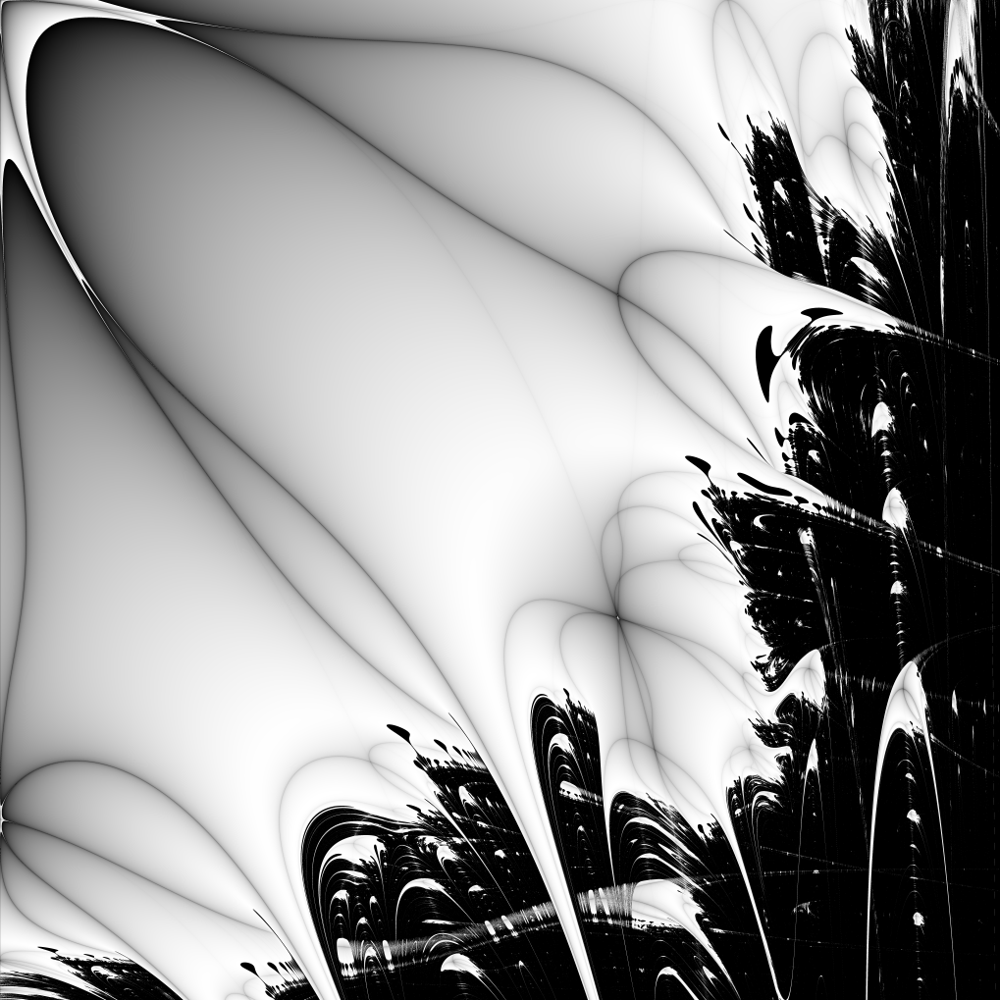

[](https://github.com/seird/fractals/actions) [](https://codecov.io/gh/seird/fractals)

# Fractals

- [C Fractal implementations](c-fractals)
- [OpenCL Fractal implementation](opencl-fractals)
- [CUDA Fractal implementation](cuda-fractals)
- [Raylib rendering](raylib-fractals)
- [Python wrapper](python-fractals)


## Performance

- cpu = 7900 @ 95W TDP
- gpu = 7900xt

```
Number of runs     =                   10
Fractal iterations =                 2000
Number of threads  =                   24
HEIGHT             =                 2048
WIDTH              =                 2048
C_REAL             =            -0.788485
C_IMAG             =             0.004913
MODE               =           MODE_JULIA
FRACTAL            =              FRAC_Z2
```

**Time per run**

|                   |   Windows   |
|-------------------|:-----------:|
|**Default**        | 4984.4 ms   |
|**Threaded**       | 275.2  ms   |
|**AVX2**           | 754.2  ms   |
|**AVX2 Threaded**  | 46.2   ms   |
|**AVX512**         | 442.6  ms   |
|**AVX512 Threaded**| 32.4   ms   |
|**OpenCL**         | 9.2    ms   |


## Examples





<p float="left">
  
   
</p>
