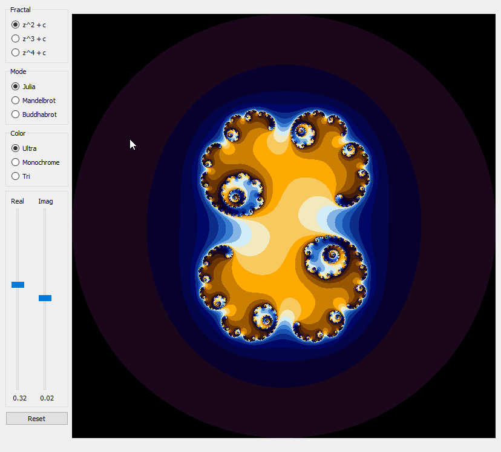
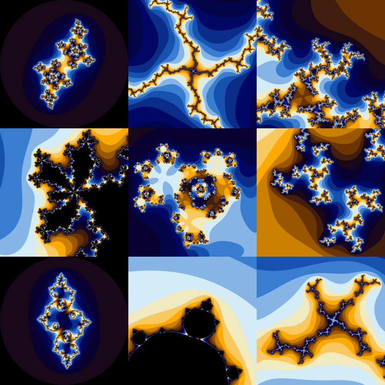
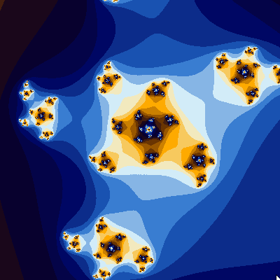
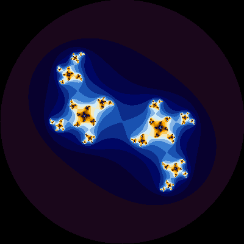
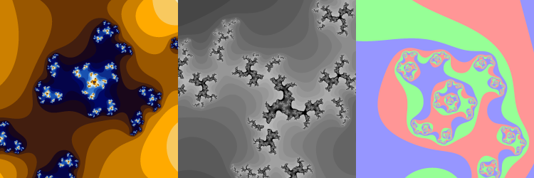

[](https://gitlab.com/kdries/opengl-fractals/commits/master)

# Fractals

- [C Fractal implementations](c-fractals)
- [OpenGL rendering](opengl-fractals)
- [Python wrapper and PyQt gui](python-fractals)


## Downloads

- [Download Windows GUI](https://gitlab.com/kdries/opengl-fractals/builds/artifacts/master/raw/python-fractals/PyFractals.zip?job=build_gui)
- [libfractal_Windows.dll](https://gitlab.com/kdries/opengl-fractals/builds/artifacts/master/raw/c-fractals/libfractal_Windows.dll?job=build_gui)
- [libfractal_Linux.dll](https://gitlab.com/kdries/opengl-fractals/builds/artifacts/master/raw/c-fractals/libfractal_Linux.dll?job=build)


## Performance

cpu = 8700k @ 4.9GHz

```
Number of runs     =                   10
Fractal iterations =                 1000
Number of threads  =                    6
ROWS               =                 1000
COLUMNS            =                 1000
C_REAL             =            -0.788485
C_IMAG             =             0.004913
MODE               =           MODE_JULIA
FRACTAL            =              FRAC_Z2
```

### Time per run

|                 |  Linux (5.4.0-54)  |  Windows  |
|-----------------|:------------------:|:---------:|
|**Default**      | 1901 ms            | 721 ms    |
|**Threaded**     | 321  ms            | 137 ms    |
|**AVX2**         | 90   ms            | 91  ms    |
|**AVX2 Threaded**| 18   ms            | 21  ms    |


## Examples











