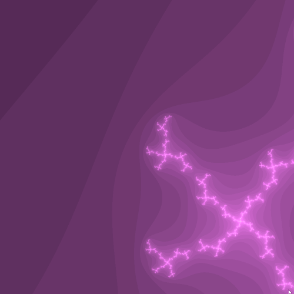

[](https://gitlab.com/kdries/opengl-fractals/commits/master)

# Fractals

- [C Fractal implementations](c-fractals)
- [OpenGL rendering](opengl-fractals)


## Performance

```
./benchmark.exe

=================================================
Benchmarking ...
        Number of runs     =                   10
        Fractal iterations =                 1000
        Number of threads  =                    6
        ROWS               =                 1000
        COLUMNS            =                 1000
        C_REAL             =            -0.788485
        C_IMAG             =             0.004913

bench_default
          1.174300 seconds per run [11.743000 seconds total]

bench_threaded
          0.576600 seconds per run [5.765999 seconds total]

bench_avx
          0.048300 seconds per run [0.483002 seconds total]

bench_avx_threaded
          0.032600 seconds per run [0.326000 seconds total]
```

## Examples



