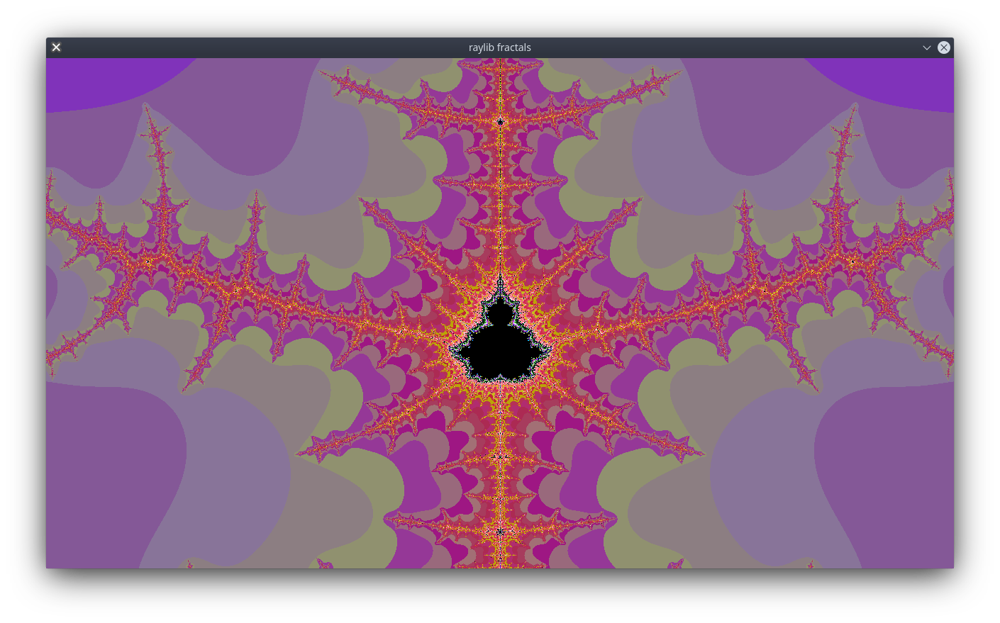

# Raylib fractals


Toy example using raylib with zooming and panning.


## Getting started

- gcc, make
- Install/build [raylib](https://github.com/raysan5/raylib/releases) (dynamic):
    ```
    $ git clone https://github.com/raysan5/raylib
    $ cd raylib/src
    ```
    - Linux:
        ```
        $ make PLATFORM=PLATFORM_DESKTOP RAYLIB_LIBTYPE=SHARED
        $ sudo make install RAYLIB_LIBTYPE=SHARED
        ```
    - Windows:
        - In "Makefile", comment out the line: "# RAYLIB_RES_FILE      ?= ./raylib.dll.rc.data"
        ```
        $ make RAYLIB_LIBTYPE=SHARED
        ```
        - Copy `raylib/src/raylib.dll` to `./raylib-fractals/raylib.dll`

- Get the compiled shared library from [c-fractals](../c-fractals)

    - Linux:
        ```
        $ sudo cp libfractal.so /usr/local/lib/
        $ LD_LIBRARY_PATH=/usr/local/lib
        $ export LD_LIBRARY_PATH
        ```
    - Windows:
        - Copy `../c-fractals/libfractal_Windows.dll` to `./raylib-fractals/libfractal.dll`

- `$ make run` to compile and run the example in src/main.c


## Examples

<p float="left">
  
   
</p>
